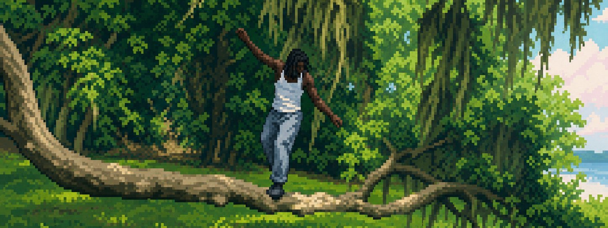
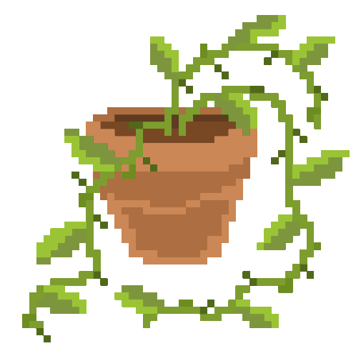
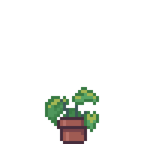

<div align="center">


# Kameron Benjamin

[](https://git.io/typing-svg)

[](https://linkedin.com/in/kameronbenjamin/)
[](mailto:kameron1.benjamin@famu.edu)


</div>

<br />

<div align="center">
  
</div>

<div align="center">
  
## 🌱 About Me 🌱

</div>

Hey, I'm Kameron, a Computer Science student at Florida A&M University (Class of 2027) who likes to grow things: software, gardens, and communities.

Right now I'm contributing through the UCSC Open Source Contributor Catalyst Program. Recently I was a C++ Teaching Assistant at FAMU and a Google CodePath Tech Exchange Scholar, and I serve as President of Strikers Dance Troupe and VP of the Delta Iota Chapter of Kappa Kappa Psi.

My projects tend to grow at the intersection of AI, full-stack development, and 3D visuals. I built a plant disease detector, a Rubik's Cube learning platform with a live 3D cube, and a space-themed portfolio rooted in my lifelong obsession with astronomy.

When I step away from the keyboard you'll catch me dancing, stepping, playing sousaphone, tending my plants, roller skating, sewing, tinkering with home servers, or brewing way too much tea.

<div align="center">
<div align="center">
  &nbsp; <h2 style="display:inline"> Tech Stack</h2> &nbsp;
  
</div>


**Languages**


**Frameworks & Libraries**


**Cloud, DevOps & Tools**


</div>

## Fruits of my labor

### [Green Guardian](https://github.com/kameron-ctrl/greenguardian)
> AI-powered plant disease detection

`Next.js` `FastAPI` `PyTorch` `AWS Lambda` `CloudFront` `Docker`

Full-stack plant health platform. Upload a leaf photo and get an instant AI diagnosis. The containerized PyTorch backend runs on AWS Lambda/ECR, and the frontend ships through S3 plus CloudFront with GitHub Actions CI/CD.

### [CubeCoach](https://github.com/kameron-ctrl/cubecoach) *(in progress)*
> AI Rubik's Cube trainer with 3D visualization

`Next.js 14` `TypeScript` `Three.js` `FastAPI` `SQLite` `Claude API`

Live 3D orbit-controlled cube, a kociemba-based solver, SM-2 spaced-repetition flashcards for OLL/PLL, and a Claude-powered coaching assistant that explains your next move.

### [Airbets AI Advisor](https://github.com/kameron-ctrl/airbets) *(in progress)*
> Sports analytics with AI-driven insights

`Python` `Streamlit` `Vertex AI`

Contributed the AI Advisor UI to a CodePath team project, where Vertex AI surfaces trend analysis and predictions drawn from live sports data.

### Space Portfolio *(in progress)*
> Interactive 3D personal portfolio site

`Three.js` `Next.js 14` `Tailwind` `Framer Motion`

A space-themed portfolio with immersive 3D scenes and orbital animations. Sections include Hero, Projects, Skills, Timeline, and Contact.

<div align="center">

## Stats


</div>

<div align="center">

[](https://git.io/streak-stats)

</div>

<div align="center">

[](https://github.com/ashutosh00710/github-readme-activity-graph)

</div>

<div align="center">
  
## 🌻 Currently Growing 🌻

</div>



| | Details |
|----|---------|
| Learning | Assembly Language (Halix), covering binary, control flow, and subroutines |
| Building | A 3D space-themed portfolio with Three.js and Next.js 14 |
| Tinkering | Home server setups and self-hosting |
| Seeking | Summer 2027 SWE roles in fintech, defense, and healthcare tech |
| Contributing | Open Source Contributor Catalyst Program at UC Santa Cruz |
| Grinding | LeetCode prep for coding interviews |

<br clear="right" />

## 🪶 Experience & Affiliations

```
Florida A&M University
   B.S. Computer Science, Class of 2027
   C++ Teaching Assistant
   Kappa Kappa Psi, VP of Delta Iota Chapter

Outamation
   AI & Data Automation Extern

CodePath
   Google Tech Exchange Scholar, Spring 2026

UC Santa Cruz
   Open Source Contributor Catalyst, Summer 2026

Strikers Dance Troupe
   President
```

## 🍵 Fun Facts

- I'll drop everything for a live NASA stream
- I play sousaphone in the FAMU Marching 100
- I grow my own plants and once built an app to keep them healthy
- Speedcubing and twisty puzzles are my idle-hands hobby
- Real life tea connoisseur, so ask me about my collection
- Big on meditation to keep the roots steady

<div align="center">



*"Education is our passport to the future, for tomorrow belongs to the people who prepare for it today."* by Malcolm X

</div>
